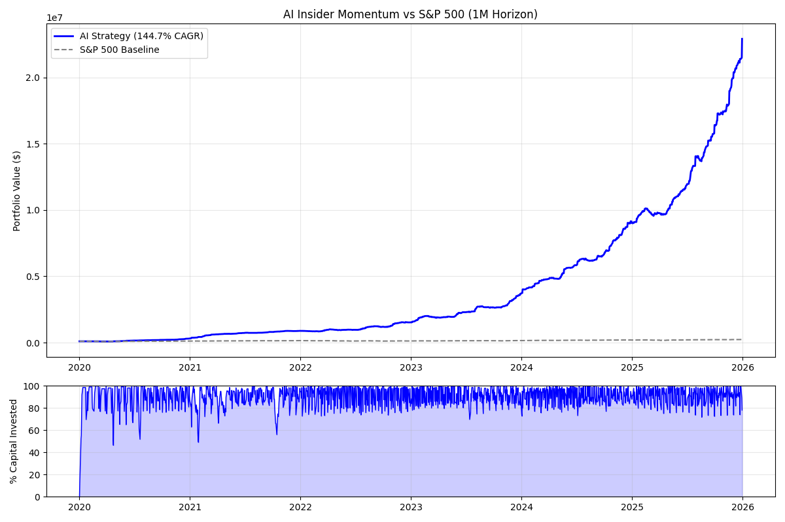
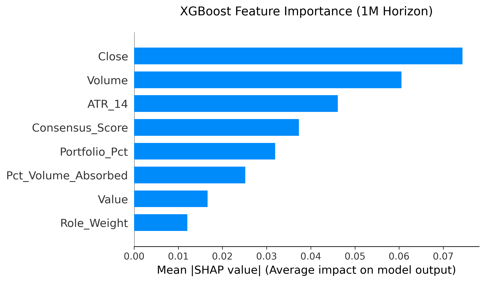

# 📈 Corporate Insider Momentum: Replicating Alpha via Machine Learning

**Status:** Completed (Historical Backtest) | **Language:** Python | **Model:** XGBoost

## Overview
This repository contains the quantitative research, data engineering pipeline, and historical backtesting engine for an algorithmic trading strategy based on SEC Form 4 corporate insider disclosures.

While retail traders operate on delayed public news, corporate insiders (CEOs, CFOs, board members) possess material, non-public information. By algorithmically filtering the noise of routine and liquidity-driven insider trading, this project isolates opportunistic, high-conviction "Wolfpack" buying behavior to generate market-beating returns. 

📄 **Read the full academic research paper:** [`Replicating_corporate_insider_alpha_via_ML.pdf`](./Replicating_corporate_insider_alpha_via_ML.pdf)

---

## 📂 Project Structure

The architecture is strictly modular to prevent data leakage between ingestion, model training, and historical backtesting. The directory has been cleaned and optimized for data efficiency.

```text
corporate-insider-momentum-research/
├── Replicating_corporate_insider_alpha_via_ML.pdf # full academic whitepaper
├── README.md                                      # this file
├── requirements.txt                               # python dependencies
├── run_pipeline.py                                # master command-line orchestrator
│
├── Data/                                          # local data warehouse (csv files ignored in git)
│   ├── ai_brain_weights_1M.png                    # shap visualizations
│   ├── strategy_vs_spy_1M.png                     # equity curve outputs
│   ├── sec_master_bulk_data.csv                   # raw edgar filings
│   ├── ml_master_matrix.csv                       # final ml-ready dataset
│   ├── ai_buy_signals_master.csv                  # consolidated ai probabilities
│   └── optimal_equity_curve_1M.csv                # backtester trade logs and equity tracking
│
├── Models/                                        # serialized machine learning brains
│   ├─ xgboost_production_1M.pkl                   
│   ├─ xgboost_production_2M.pkl                   
│   └─ xgboost_production_6M.pkl
│
└── Src/                                           # core research environment
    ├─ data_01_insider_scraper.py                  # sec edgar ingestion (2010-2025)
    ├─ data_02_market_fetcher.py                   # yahoo finance ohlcv mapping
    ├─ data_03_db_baseline.py                      # database compilation
    ├─ feat_04_cleaning.py                         # data sanitization & filtering
    ├─ feat_05_engineering.py                      # technicals (atr) & consensus weighting
    ├─ model_06_train_static.py                    # static multi-horizon model training
    ├─ model_07_explain_shap.py                    # shap game-theory interpretation
    ├─ quant_08_backtest_static.py                 # capital-constrained kelly backtester
    └─ viz_09_performance.py                       # matplotlib equity visualizations

```

---

## ⚙️ Methodology

The pipeline is designed to process unstructured government data into a strict financial framework:

1. **Data Ingestion & Fidelity:** Scrapes and parses bulk SEC EDGAR Form 4 filings. Excludes 'Sell' transactions to eliminate liquidity-driven noise and enforces strict tradability filters (Price > $2.00, Volume > 50,000).
2. **Feature Engineering:** Calculates 14-day rolling volatility (`ATR_14`), market liquidity absorption, and executive hierarchical weighting. Aggregates intraday "drip-feed" institutional orders into unified daily signals.
3. **Machine Learning:** An XGBoost classifier is trained to predict positive momentum across multiple horizons (1M, 2M, 6M), outputting a continuous probability score (AI Confidence) rather than a rigid binary signal.
4. **Dynamic Sizing & Risk Management:** Signals are passed through a capital-constrained backtester using Half-Kelly Criterion mathematics and a strict 5% max risk cap to optimize position sizing net of trading friction.

---

## 📊 Backtest Results & Visual Analysis

To maximize geometric portfolio growth while strictly managing drawdown, the backtest simulated a **$100,000 portfolio** from **Jan 2020 to Dec 2025**.

The system was evaluated across three distinct holding horizons, revealing a massive regime shift in the AI's logic:

| Horizon | Optimal Threshold | True CAGR | Max Drawdown | Sharpe Ratio | Win Rate |
| --- | --- | --- | --- | --- | --- |
| **1-Month (Momentum)** | 60% | **+144.7%** | -16.7% | 5.51 | 59.1% |
| **2-Month (Balanced)** | 34% | **+93.1%** | -10.1% | 3.39 | 55.1% |
| **6-Month (Fundamental)** | 60% | **+58.3%** | **-2.8%** | 2.42 | **60.6%** |

*Note: The 1-Month model was selected as the primary strategy for live deployment due to its hyper-aggressive geometric compounding.*

### Test Examples

**1. Output Equity Curve vs. S&P 500 (1-Month Strategy)** The strategy heavily outperforms the benchmark by capturing rapid, volatility-adjusted momentum following insider disclosures.



**2. SHAP Feature Importance (1-Month Strategy)** Opening the "Black Box" reveals that for short-term holds, the AI prioritizes market microstructure (`Close`, `Volume`, `ATR_14`) to capture immediate momentum, using insider signals (`Consensus_Score`) as secondary filters.



---

## 🧪 How to Run / Reproduce

This research environment is orchestrated via a master Command Line Interface (CLI) script (`run_pipeline.py`) to ensure strict reproducibility and modular auditing.

**1. Install Dependencies:**
```bash
pip install -r requirements.txt

```

**2. Run the Full Pipeline (End-to-End):**
By default, the orchestrator will execute the entire sequence from scratch: SEC EDGAR ingestion, feature engineering, multi-horizon AI training, and the Kelly Criterion backtest.

```bash
python run_pipeline.py --mode full

```

**3. Modular Execution (Component Auditing):**
If you wish to isolate specific environments of the pipeline without rebuilding the entire dataset, pass the `--mode` flag:

* **Build the Data Warehouse Only:** (Scrapes SEC, fetches OHLCV, engineers technical features)
```bash
python run_pipeline.py --mode data_only

```

* **Run the Static AI & Backtest Only:** (Trains the XGBoost models on pre-built data, evaluates Kelly position sizing, and generates SHAP game-theory graphs)
```bash
python run_pipeline.py --mode static_run

```

* **Run the Walk-Forward Optimization:** (Executes rigorous out-of-sample rolling window testing)
```bash
python run_pipeline.py --mode wfo_run

```

**4. View Results:**
All quantitative performance metrics (CAGR, Sharpe, Max Drawdown) will output directly to the terminal. Generated `.pkl` models, trade logs, and visual performance charts are automatically saved to the `Data/` directory.

---

*Disclaimer: This repository is for academic and quantitative research purposes only. It does not constitute financial advice. The live execution engine (API keys, order routing, and cloud automation) is maintained in a separate, private repository to protect proprietary infrastructure.*

---

© 2026 Charles Husson. All Rights Reserved. This repository is provided for academic review and portfolio demonstration purposes only. No license is granted for commercial or personal use.